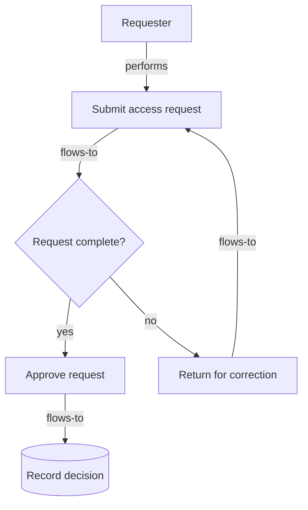

# Diagram representation

The diagram is the visual fold of [`code.mmd`](./code.mmd). The Mermaid source
is included below so a reviewer can render it with a compatible Mermaid
renderer. This repository does not claim that a renderer or visual parser ran;
the proof uses the source-level diagram anchors and records that limitation.

## Semantic and governance trace

| Node ID | Semantic role | Directed relationships |
|---|---|---|
| `requester` | `actor` | `performs → submit` |
| `submit` | `step` | `flows-to → review` |
| `review` | `decision` | `yes → approve`; `no → return` |
| `approve` | `approval` | `flows-to → record` |
| `return` | `handoff` | `flows-to → submit` |
| `record` | `data` | terminal |

The two branches are `complete` (`review → approve`, “request is complete”)
and `incomplete` (`review → return`, “request is incomplete”). The governance
tags are `artifact_version: 1.0.0`, `owner: refoldec-maintainers`, `status:
fixture`, and `applicable_context: public-safe synthetic demonstration`.
Coordinates, colors, shape rendering details, and renderer chrome are
allowed-to-vary properties and are excluded from comparison.
