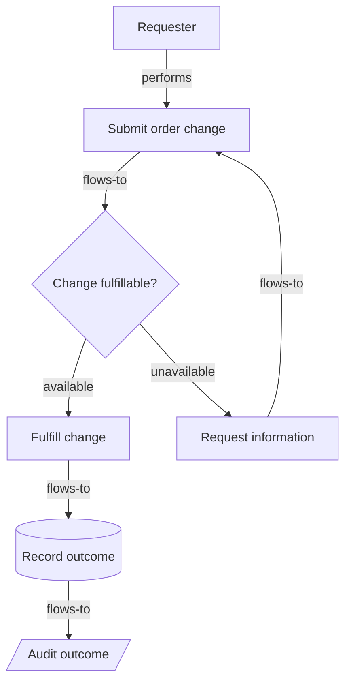

# Diagram representation

The diagram is the visual fold of [`code.mmd`](./code.mmd). The Mermaid source
is included below so a reviewer can render it with a compatible Mermaid
renderer. This repository does not claim that a renderer or visual parser ran;
the proof uses the source-level diagram anchors and records that limitation.

## Semantic and governance trace

| Node ID | Semantic role | Directed relationships |
|---|---|---|
| `requester` | `actor` | `performs → submit` |
| `submit` | `step` | `flows-to → validate` |
| `validate` | `decision` | `available → fulfill`; `unavailable → request-info` |
| `fulfill` | `system` | `flows-to → record` |
| `request-info` | `handoff` | `flows-to → submit` |
| `record` | `data` | `flows-to → audit` |
| `audit` | `log` | terminal |

The two branches are `available` (`validate → fulfill`, “the requested change
can be fulfilled”) and `needs-information` (`validate → request-info`, “the
requested change cannot yet be fulfilled”). The governance tags are
`artifact_version: 1.0.0`, `owner: refoldec-maintainers`, `status: fixture`, and
`applicable_context: public-safe synthetic demonstration`.
Coordinates, colors, shape rendering details, and renderer chrome are
allowed-to-vary properties and are excluded from comparison.